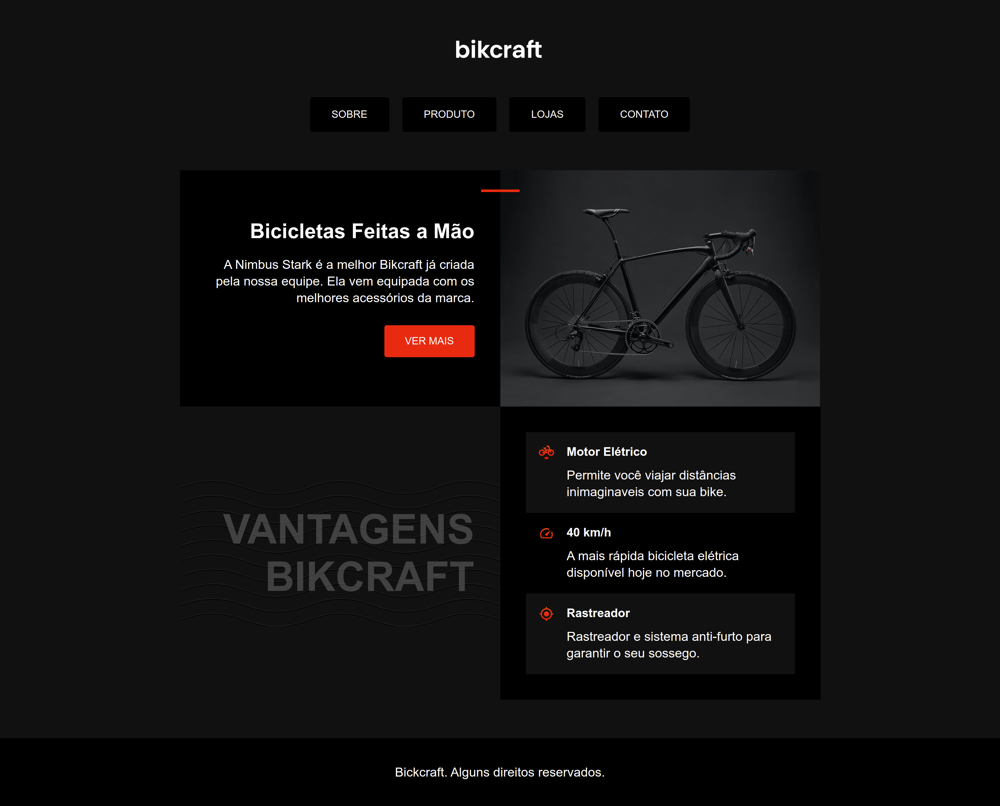

# Bikcraft

#### Pequeno projeto **_front-end_** para aplicar conhecimentos de HTML e CSS.

#### Recursos utilizados :

-   Grid Layout;
-   Flexbox;
-   Pseudo-classes;
-   Pseudo-elementos;
-   HTML Semântico;
-   Responsividade através de media queries;
-   Dark Mode;
-   Propriedades Customizadas;

# Especificações

### Cores:

```
cinza: #f7f7f7;
cinza-escuro: #c6c6c6;
vermelho: #ee2211;
```

### Tipografia:

```
fonte: Arial;
parágrafos: 20px;
Vantagens Bikcraft: 64px;
```

### Tamanhos:

```
conteúdo principal: máximo 1000px;
```

# Resultado final


# Resultado final com dark mode


